### 简介

本项目技术栈基于[vue](https://cn.vuejs.org/index.html)、[vuex](https://vuex.vuejs.org/zh-cn/)、[vue-router](https://router.vuejs.org/zh-cn/) 、[vue-cli](https://github.com/vuejs/vue-cli) 、[axios](https://github.com/axios/axios) 和 [element-ui](https://github.com/ElemeFE/element)，是一个vue全家桶 + element-ui编写的博客前端项目，简约风格，功能完善，具备完备的后台管理和前端数据展示，同时项目通过媒体查询等技术适配移动端，是一个响应式的前端项目。

> 数据通过接口Api方式获取，因此前端项目运行需启动后端项目，后端项目地址：https://github.com/copoile/blog-api.git

在线接口文档: [http://doc.poile.cn/api](http://doc.poile.cn/api)

> Api文档使用GitBook编写，文档源码地址: [https://github.com/copoile/blog-api-doc.git](https://github.com/copoile/blog-api-doc.git)

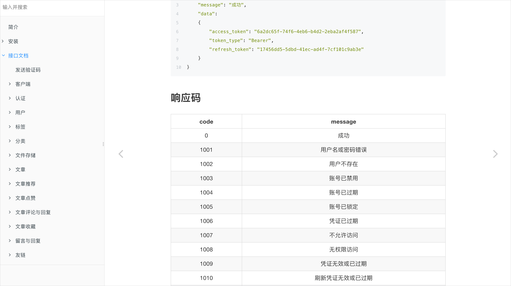


### 功能

``` 
- 账号注册
- 账号登录 / 手机号登录
- 个人信息
- 绑定邮箱 / 绑定手机号
- 修改密码 / 重置密码
- 文章编辑（MarkDown编辑器）
- 文章管理
- 文章推荐
- 用户管理
- 分类管理
- 标签管理
- 收藏管理
- 博客友链
- 客户端管理
- 首页
- 分类
- 归档
- 标签
- 友链
- 留言
- 文章 / 收藏 / 点赞 / 评论 / 回复 / 相关推荐
- 其他
```


### 开发

```
# 克隆项目
git clone https://github.com/copoile/blog-web.git

# 进入项目目录
cd blog-web

# 安装依赖
npm install

# 建议不要直接使用 cnpm 安装依赖，会有各种诡异的 bug。可以通过如下操作解决 npm 下载速度慢的问题
npm install --registry=https://registry.npm.taobao.org

# 启动服务
npm run dev
```


### 项目展示

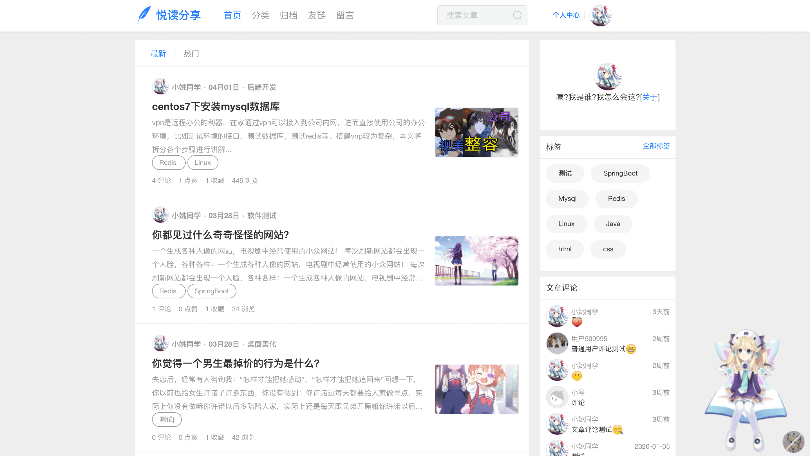


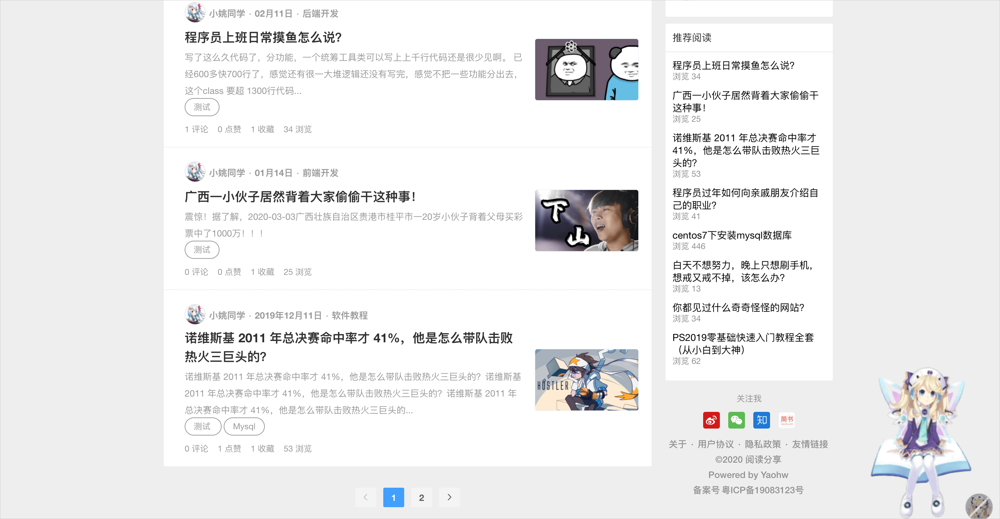


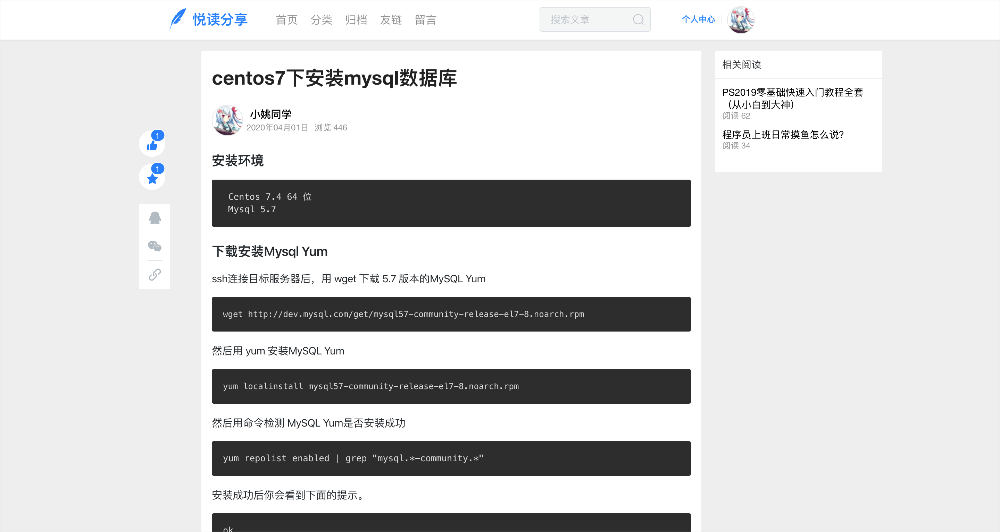


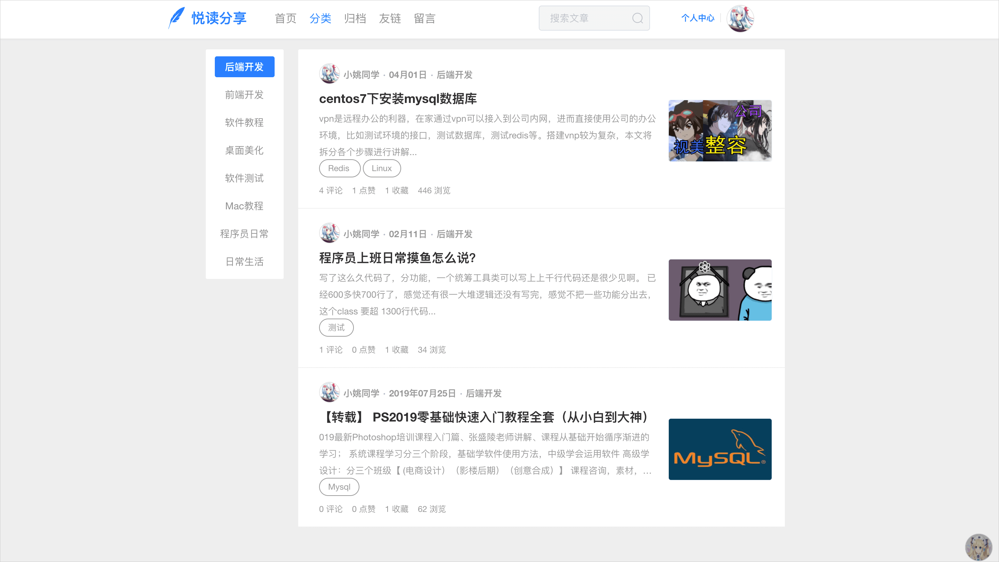


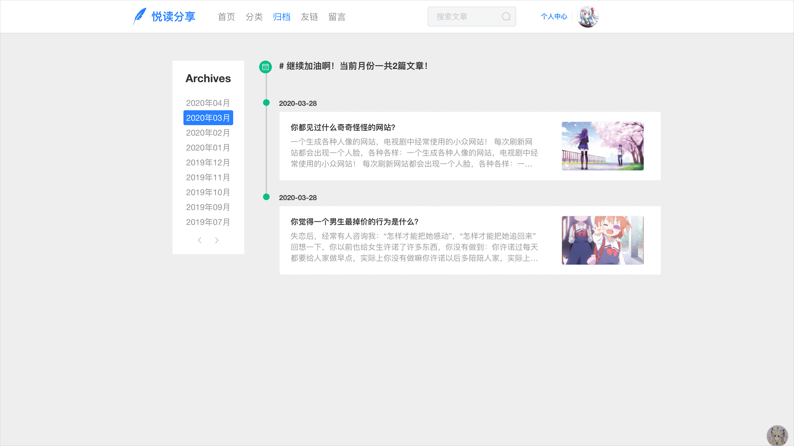


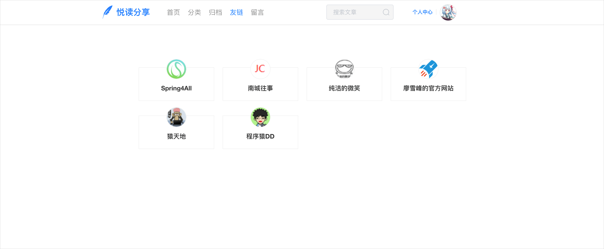


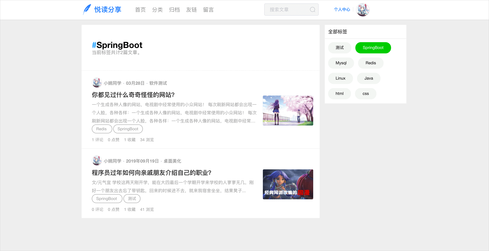


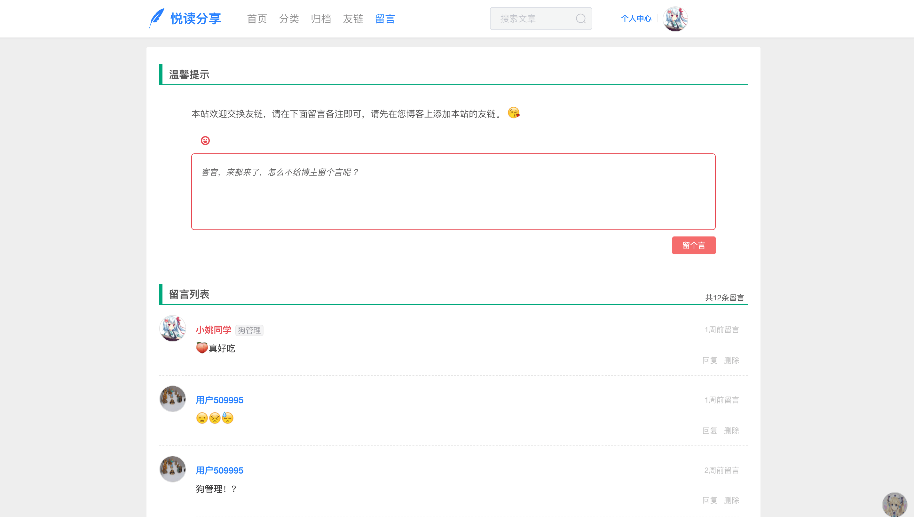


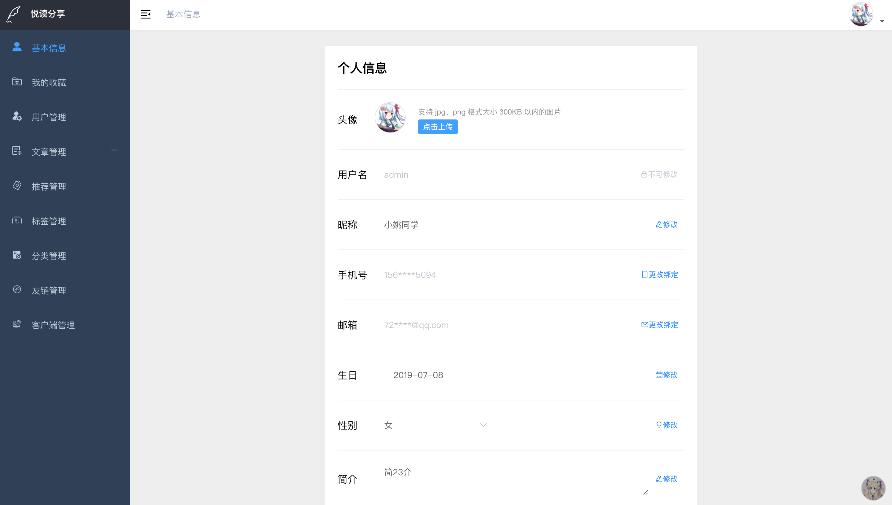


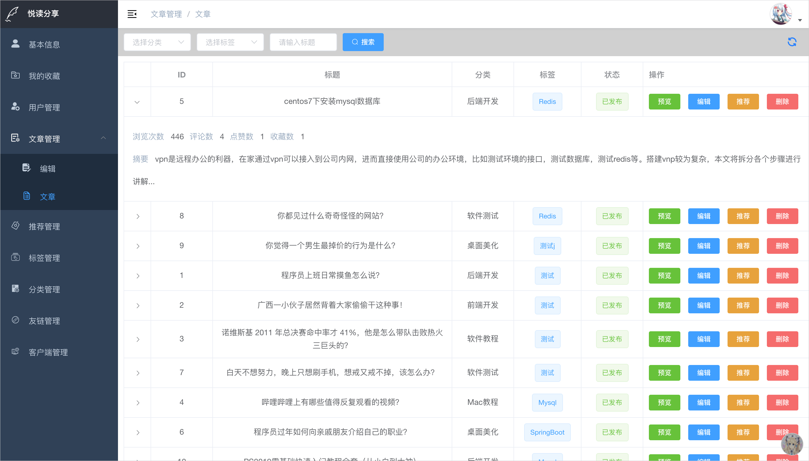


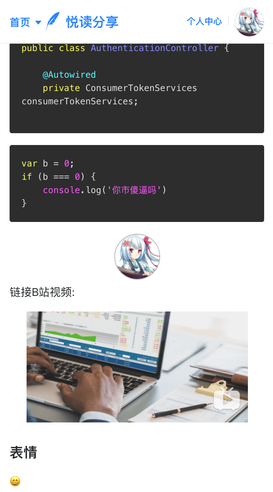


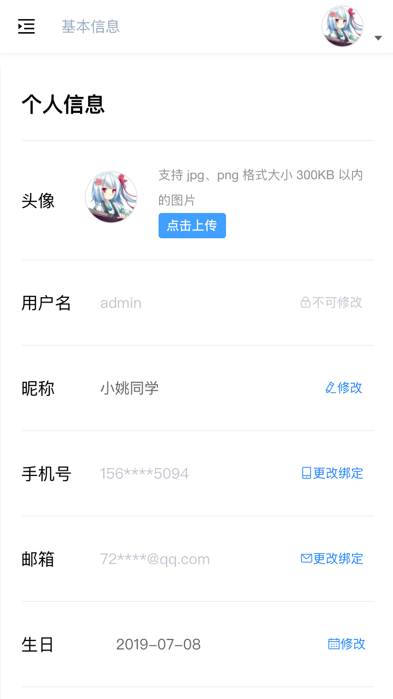


### License

[MIT](https://github.com/copoile/blog-web/blob/master/LICENSE)

Copyright (c) 2020-present Yaohw

